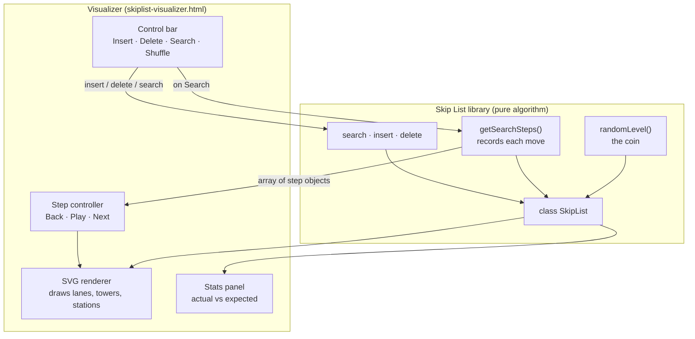
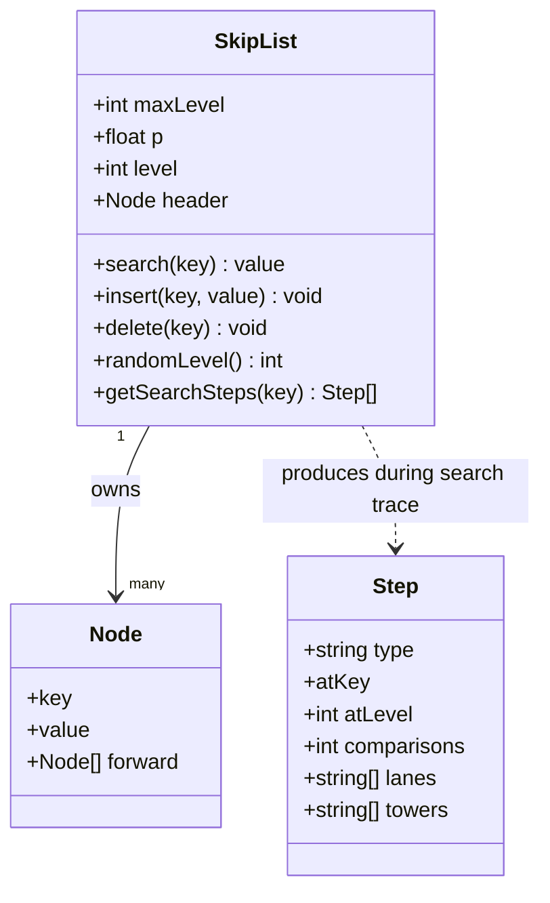
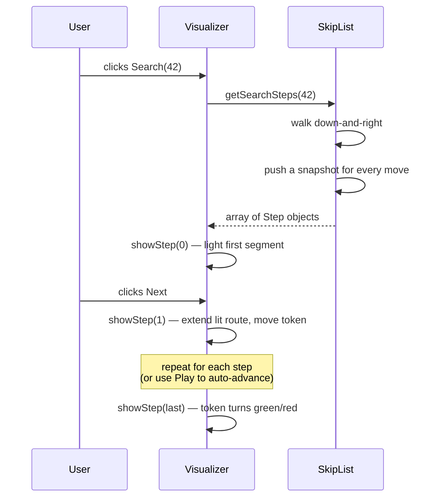

# Skip List — Express Lane Visualizer

A custom implementation of the **Skip List** data structure in JavaScript,
together with an interactive web-based visualizer that animates how elements are
probabilistically promoted to higher "express lanes" and how a search traverses
the structure down and to the right. I wanted to make the visualization more interesting, by creating the Transit-map metaphor.

Built as the final project for the Algorithm Analysis course, based on:

> Pugh, W. (1990). *Skip Lists: A Probabilistic Alternative to Balanced Trees.*
> Communications of the ACM, 33(6), 668–676.

---

## Live demo

➡️ **[Open the visualizer](./skiplist-visualizer.html)**

(If you are reading this on GitHub Pages, the link above opens the running app.
If you are reading the source on github.com, see *How to run* below.)

---

## What is a skip list

A skip list is a sorted linked list with **shortcut lanes** stacked on top of it.
The bottom lane (Level 1) contains every element. Higher lanes contain roughly
half as many elements each — and which elements appear on which lane is decided
by **coin flips at insertion time**, not by a balancing rule. The lucky tall
towers act as express stops, letting a search skip over big chunks of the list
instead of walking one node at a time. The result: expected `O(log n)` search,
insert, and delete, with code far simpler than balanced trees.

---

## How to run

The whole project is two HTMLs.

**Option A — locally:**
Download the repository and double-click `skiplist-visualizer.html`. It opens
in your browser and runs.

**Option B — hosted (GitHub Pages):**
This repository is configured to serve the visualizer directly. Open the
*Live demo* link above.

---

## Files in this repository

| File | What it is |
|---|---|
| `skiplist-visualizer.html` | The main interactive app. Includes the library code, the SVG renderer, and the step-through search controls. |
| `skiplist-library.html` | A minimal demo page that only loads the library and prints the structure as text. Useful for understanding the algorithm without the UI noise. |
| `README.md` | This file. |

---

## Using the visualizer

| Action | What happens |
|---|---|
| Type a number, click **Insert** | The value is inserted. Its tower height is rolled by the coin-flip routine, so the same value can produce different shapes on different runs. |
| Click **Delete** | Removes the value if present. |
| Click **Search** | Records every move of the search and switches the app into step-through mode. |
| **◀ Back / Next ▶** | Walk the search forward or backward one move at a time. |
| **▶ Play** | Auto-advances the steps with animation. |
| **Shuffle** | Wipes the list and rebuilds it with a fresh random sample, so you can see new tower shapes. |
| **coin p** | Switches the probability used by the coin between `1/2` and `1/4`. Affects nodes inserted *after* the change. |
| Arrow keys ← → | Same as Back / Next when a search is active. |

The lit dark ribbon shows the **search path**: the route the algorithm took
through the lanes. It always travels down and to the right.

---

## The algorithm

The implementation follows the paper directly. Three operations:

### Search

Start at the header on the **highest** level. On each level, walk **right**
while the next node's key is still smaller than the target. When the next node
would overshoot (or is `NIL`), drop **down** one level and continue. At the
bottom level the algorithm lands immediately in front of the answer.

```text
header ─────────────────►─────────────────► …
       │
       ▼  (drop down a level when nothing smaller lies ahead)
       ─────►─────►─────► …
                       │
                       ▼
                       ───►───►───► found
```

### Insert

Same down-and-right search, but each level remembers the last node visited in
an array called `update`. Then a random height is rolled by `randomLevel()` and
the new node is spliced in — for each level it reaches, the pointer of the
remembered predecessor is rewired to point at the new node, and the new node's
pointer takes over where the predecessor's used to point. Standard linked-list
splice, repeated per level.

### Delete

Same search-and-record. If the target is found, the algorithm unhooks it on
every level it appears on. If the top levels of the list become empty as a
result, the list's recorded level is lowered so future searches don't waste
time entering empty floors.

### The coin: `randomLevel()`

```text
level = 1
while random() < p  and  level < MaxLevel:
    level += 1
return level
```

With `p = 1/2`, about 50% of nodes stay at level 1, 25% reach level 2, 12.5%
reach level 3, and so on. No balancing logic anywhere — the distribution
emerges from the coin alone.

---

## Mathematical analysis

This section corresponds to the *Algorithmic Efficiency & Math Proof* part of
the rubric. All results are taken from Pugh (1990); the implementation matches
the algorithms and inherits their guarantees.

### Expected search cost

Let `n` be the number of elements and `p` the promotion probability. Define
`L(n) = log_{1/p}(n)`. Analyzing the search path *backwards* (climbing up from
the found node toward the header), the expected number of upward climbs to
reach level `L(n)` is bounded by `(L(n) − 1)/p`, and the leftward movements
above that level are bounded in expectation by `1/p`. Adding the contributions:

```text
Expected search cost  ≤  L(n)/p  +  1/(1 − p)   =  O(log n)
```

For `p = 1/2`, that gives about `2 · log₂ n + 2` comparisons. For `p = 1/4`,
roughly `log₄ n / 0.25 + 1/0.75 ≈ 2 · log₂ n + 1.33`. The visualizer prints
this bound live in the *Search comparisons* panel as `~expected`, next to the
actual count of the most recent search.

### Worst case

The worst case is `O(n)` — but it requires an unlikely sequence of coin flips,
not an unlucky input. Because the structure is decided by the random number
generator and not by the order of insertions, no adversarial input can force
worst-case behaviour the way it can with a naive BST. Pugh shows that for a
skip list of 250 elements, the chance that a search takes more than three
times the expected time is less than one in a million; for 4096 elements with
`p = 1/2`, the same probability drops to one in 200 million.

### Expected vs. worst-case tower height

The probability that any given node reaches level `k` is `p^(k−1)`. The
probability that the *maximum* level in the list exceeds `k` is at most
`n · p^k`. Solving for the expected maximum: about `L(n) + 1/(1 − p)`. The
visualizer prints `L(n)` next to the actual tallest tower as a side-by-side
comparison, so the agreement between theory and observation can be inspected
at a glance.

### Space

Each node carries `1/(1 − p)` forward pointers on average. For `p = 1/2` that
is 2 pointers per node; for `p = 1/4` it drops to 1.33. Total space is
`O(n)` either way, and no balance information is stored per node — a real
practical advantage over balanced trees.

### Summary table

| Operation | Expected | Worst case | Notes |
|---|---|---|---|
| Search | `O(log n)` | `O(n)` | Worst case requires unlucky coin flips, not adversarial input. |
| Insert | `O(log n)` | `O(n)` | Dominated by the search; the splice itself is `O(level of new node)`. |
| Delete | `O(log n)` | `O(n)` | Same shape as Insert. |
| Space | `O(n)` | `O(n log n)` | Expected `n / (1 − p)` pointers total. |

---

## Architecture

The project is small enough that the entire system fits in one diagram. The
library is pure data-structure code with no UI dependencies; the visualizer
sits on top of it and talks to it through one extra method, `getSearchSteps`,
which re-runs a search but records every move so the UI can replay it
forward and backward.



### The data structure itself



### What happens on a search, step by step



---

## Design decisions worth knowing about

**Transit-map metaphor.** The visualizer presents nodes as stations and
levels as colored train lines (Level 1 is the "local" that stops everywhere;
higher levels are express lines). This is purely a UI device — internally the
library uses the standard terminology from Pugh's paper (node, level, forward
pointer, header, MaxLevel). The metaphor was chosen because the "express lane"
intuition is the cleanest way to communicate why higher levels exist at all.

**Step traces as data.** The animation is not coupled to the algorithm.
`getSearchSteps` produces a plain array of step descriptions; the UI is just
a player that walks that array. This means the same trace can be stepped
forward, backward, or scrubbed without re-running the search, and the
algorithm code stays free of UI concerns.

**Index from 1, not 0.** The `forward` array is sized one larger than needed
so that `forward[i]` corresponds directly to level *i* in the paper's
pseudocode. Slot 0 is intentionally unused; the cost is one wasted pointer
per node, the benefit is that the implementation can be read side by side
with Figures 2 and 4 of the paper without any index translation.

**No external libraries.** No external libraries were used to keeps things running easier.

---

## References

- Pugh, W. (1990). *Skip Lists: A Probabilistic Alternative to Balanced
  Trees.* Communications of the ACM, 33(6), 668–676.
- Papadakis, T., Munro, J. I., & Poblete, P. V. (1992). *Analysis of the
  expected search cost in skip lists.* Cited in Pugh (1990) as a tighter
  bound on the expected search cost.
